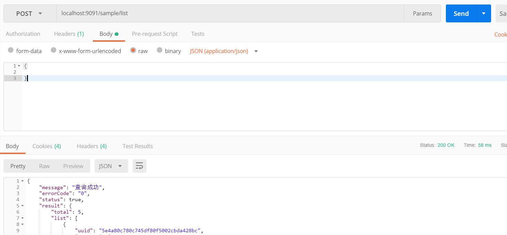
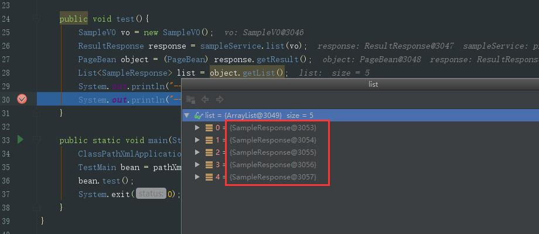

### 项目介绍

- 项目依赖环境：JDK1.8+,zookeeper
- 功能：dubbo rpc 脚手架，提供dubbo rpc、RESTful api，数据库事物管理(应用于service层)，maven多环境打包(dev、prod、test)
- 多环境打包：mvn clean install -P dev
### 测试
- 运行提供者(sample-provider)
  

  查询接口不传参数时，默认分页查询全部

- 测试消费者(sample-consumer)


  运行TestMain.java,查看返回的信息(sample先启动，连接同一个zookeeper)


项目正常运行成功~~~

### 测试事物管理

```java
public Integer addSample(SampleVO sampleVO) throws Exception {
        SampleEntity entity = new SampleEntity().voToEntity(sampleVO);
        Integer code =  sampleBiz.addSample(entity);
        // 测试事务管理  模拟异常产生  
        int test = 1/0;
        return code;
    }
```

将上面的除以零打开注释，在请求增加接口，数据库中不会增加数据

```json
POST: localhost:9092/sample/addSample
Content-Type:application/json
Body:
{
    "name": "test_dem23o8"
}
```

如果没有在`sample-provider.xml`中配置事务处理，数据库是会增加这一条数据的


### 分支介绍
| 分支     | 介绍   |
| ------ | ---- |
| master | 最新代码 |


- `数据对象`：       xxxDO     xxx即为数据表名
- `数据传输对象`：   xxxDTO    xxx为业务领域相关的名称
- `展示对象`：       xxxVO     xxx一般为网页名称
- `POJO是DO/DTO/BO/VO的统称`  禁止命名成xxxPOJO

PO的属性是跟数据库表的字段一一对应的。 PO对象需要实现序列化接口。 

VO，V层中用到的基本元素与方法等放其中。如果要其调用BO，则要做BO转换VO，VO转换BO操作。VO的好处是其页面的元素属性多于BO，可起到很好的作用。。。。 